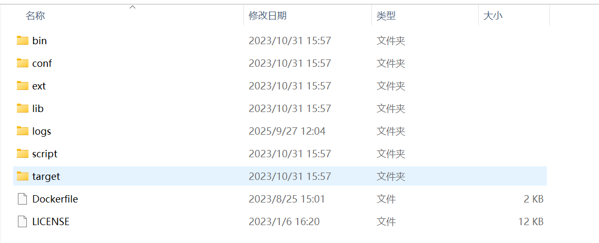
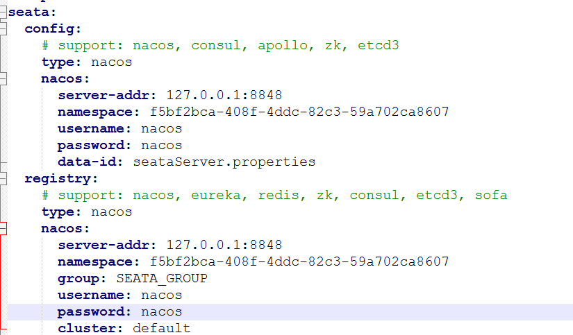
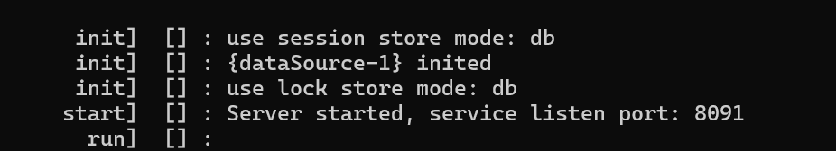

# Spring Cloud Alibaba seata 案列
## 服务配置
### 1. 下载 seata 服务(当前版本使用的是 1.8.0) : [官网下载](https://seata.apache.org/zh-cn/release-history/seata-server)
   - 解压后目录结构如下<br/>
   
### 2. 配置 seata 服务
   - 找到 script->server->db 导入对应版本的数据库
   - 找到 conf->application.yml 进行配置(主要是更新 config 与 registry，配置详解可以问百度或AI。但需要注意 data-id: seataServer.properties 的配置我是保存在了 nacos 的配置管理->下一项详解)<br/>
   <br/><br/>
   - seataServer.properties 配置详解<br/>
   直接复制 script->config-center->config.txt 的全部内容到 seataServer.properties 中，然后更新主要参数如下：<br/>
      ````properties
      service.vgroupMapping.default_tx_group=default #更新命名-> service.vgroupMapping.g1=ip1
      service.default.grouplist=127.0.0.1:8091 #更新命名-> service.ip1.grouplist=127.0.0.1:8091
      store.mode=file #更新存储模式-> store.mode=db
      store.db.datasource=druid #更新数据库配置(详细自行检查更新即可)
      ````
### 3. 启动 seata 服务
   - 找到 bin目录下 seata-server.bat(Windows) 或 seata-server.sh(Linux) 启动服务<br/>
   - 如果配置成功会看到 use session store mode: db 与 use lock store mode: db 的提示<br/>
   
## 客户端配置
### 1. 配置客户端（spring boot 案列）
   - 引入pom依赖
   ```xml
   <dependency>
        <groupId>org.springframework.boot</groupId>
        <artifactId>spring-boot-starter</artifactId>
    </dependency>
    <dependency>
        <groupId>io.seata</groupId>
        <artifactId>seata-spring-boot-starter</artifactId>
        <version>1.8.0</version>
    </dependency>
    <dependency>
        <groupId>mysql</groupId>
        <artifactId>mysql-connector-java</artifactId>
        <version>8.0.28</version>
    </dependency>
    <dependency>
        <groupId>org.springframework.boot</groupId>
        <artifactId>spring-boot-starter-jdbc</artifactId>
    </dependency>
   ```
   - 配置 application.yml加上如下:
   ```yml
    #tx-service-group: g1 这个最重要-需要与服务 service.vgroupMapping.g1=ip1 匹配，服务命名为了 g1 所以这里也写 g1
    seata:
      tx-service-group: g1
      registry:
        nacos:
          server-addr: 127.0.0.1:8848
          namespace: f5bf2bca-408f-4ddc-82c3-59a702ca8607
          group: SEATA_GROUP
          username: nacos
          password: nacos
      config:
        type: nacos
        nacos:
          server-addr: 127.0.0.1:8848
          namespace: f5bf2bca-408f-4ddc-82c3-59a702ca8607
          username: nacos
          password: nacos
          data-id: seataServer.properties
   ```
### 2. 启动服务
 - 启动成功会输出类似如下信息
 ```text
RM will register :jdbc:mysql://127.0.0.1:3306/seata
NettyPool create channel to transactionRole:RMROLE,address:127.0.0.1:8091,msg:< RegisterRMRequest{resourceIds='jdbc:mysql://127.0.0.1:3306/seata', version='1.8.0', applicationId='services-transactional', transactionServiceGroup='g1', extraData='null'} >
register RM success. client version:1.8.0, server version:1.8.0,channel:[id: 0x0bd14fd3, L:/127.0.0.1:59642 - R:/127.0.0.1:8091]
register success, cost 9 ms, version:1.8.0,role:RMROLE,channel:[id: 0x0bd14fd3, L:/127.0.0.1:59642 - R:/127.0.0.1:8091]
Auto proxy data source 'dataSource' by 'AT' mode.
 ```
### 3. 然后你就可以下载 seata官方的源码用来测试或使用了
- [源码地址](https://github.com/seata/seata-samples)
- 下载自己想要的模式（AT、TCC、SAGE、XA）或copy出想要的代码调试测试即可
- 也可以参考当前项目 - 
  - AT 模式在 trans-at 项目下：访问 BusinessController 测试或自己写测试案列
  - TCC 模式在 trans-tcc 项目下：访问 BusinessController 测试或自己写测试案列
  - SAGE 模式在 trans-sage 项目下：访问 BusinessController 测试或自己写测试案列
  - XA 模式在 trans-xa 项目下：访问 BusinessController 测试或自己写测试案列
